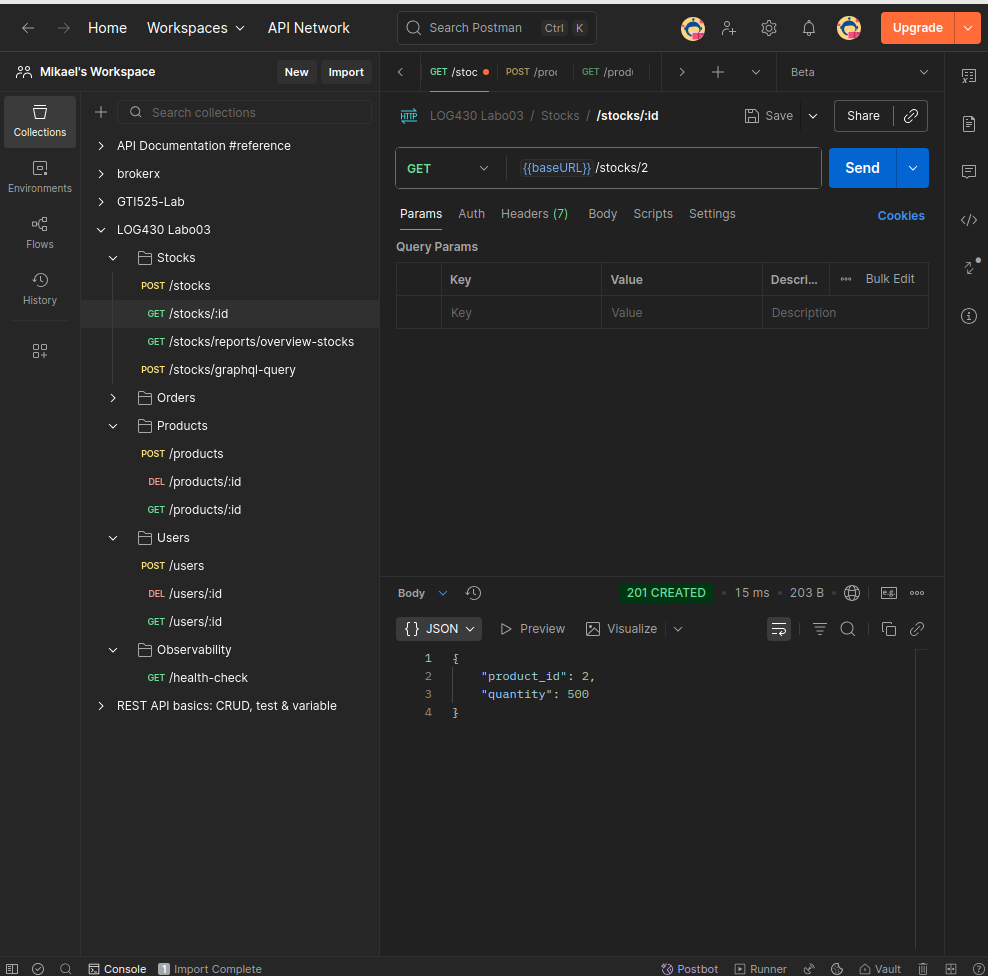

## Question 1 : Quel nombre d'unités de stock pour votre article avez-vous obtenu à la fin du test ? Et pour l'article avec id=2 ? Veuillez inclure la sortie de votre Postman pour illustrer votre réponse.

### Résultats obtenus

**Article testé (créé pendant le test) :**
- **ID du produit :** 7
- **Stock final :** 5 unités
- **Statut :**Test réussi - Le stock a été correctement restauré après suppression de la commande

**Article existant (ID=2) :**
- **Stock :** 500 unités
- **Statut :** Inchangé - Aucun impact des tests sur les autres données

### Détail de l'exécution du smoke test

```bash
tests/test_store_manager.py::test_stock_flow 
API Health Check: {'status': 'ok'}
Produit créé avec ID: 7
Utilisateur créé avec ID: 7
Stock créé - 5 unités ajoutées
Stock vérifié: 5 unités disponibles
Commande créée avec ID: 2 - 2 unités commandées
Stock après commande: 3 unités restantes
Commande 2 supprimée
Stock après suppression de commande: 5 unités (restauré)
Smoke test du flux de stock terminé avec succès!
```

### Vérification avec Postman



## Question 2 : Décrivez l'utilisation de la méthode join dans ce cas. Utilisez les méthodes telles que décrites à Simple Relationship Joins et Joins to a Target with an ON Clause dans la documentation SQLAlchemy pour ajouter les colonnes demandées dans cette activité. Veuillez inclure le code pour illustrer votre réponse.

### Utilisation de la méthode JOIN dans notre implémentation

#### Code implémenté :

```python
def get_stock_for_all_products():
    """Get stock quantity for all products"""
    session = get_sqlalchemy_session()
    results = session.query(
        Stock.product_id,
        Stock.quantity,
        Product.name,
        Product.sku,
        Product.price
    ).outerjoin(Product, Stock.product_id == Product.id).all()
    
    stock_data = []
    for row in results:
        stock_data.append({
            'Article': row.product_id,
            'Nom': row.name or 'Produit non trouvé',
            'Numéro SKU': row.sku or 'N/A',
            'Prix unitaire': float(row.price) if row.price else 0.0,
            'Unités en stock': int(row.quantity),
        })
    
    return stock_data
```

#### Analyse selon la documentation SQLAlchemy :

**1. Simple Relationship Joins :**
- Utilisation de `.outerjoin()` (LEFT JOIN) pour lier la table `Stock` avec la table `Product`
- Permet d'obtenir toutes les informations des stocks avec les détails des produits correspondants
- Syntaxe simple et lisible : `Stock → Product`

**2. Joins to a Target with an ON Clause :**
- Clause ON explicite : `Stock.product_id == Product.id`
- Join basé sur la clé étrangère logique entre les tables
- Assure la correspondance correcte entre les enregistrements des deux tables

#### Pourquoi LEFT JOIN au lieu d'INNER JOIN ?

- Inclut TOUS les stocks, même sans produit correspondant
- Évite la perte de données en cas d'incohérence
- Gère les cas où un produit pourrait être supprimé mais le stock reste


## Question 3 : Quels résultats avez-vous obtenus en utilisant l’endpoint POST /stocks/graphql-query avec la requête suggérée ? Veuillez joindre la sortie de votre requête dans Postman afin d’illustrer votre réponse.


## Question 4 : Quelles lignes avez-vous changé dans update_stock_redis? Veuillez joindre du code afin d'illustrer votre réponse.

### Modifications apportées à la fonction `update_stock_redis`

J'ai enrichi la fonction `update_stock_redis` pour qu'elle stocke automatiquement les informations complètes du produit dans Redis, pas seulement la quantité. Voici les modifications :

#### **Avant (version originale) :**
```python
pipeline.hset(f"stock:{product_id}", "quantity", new_quantity)
```

#### **Après (version améliorée) :**
```python
stock_update = {"quantity": new_quantity}

if not current_stock_data.get('name'):
    session = get_sqlalchemy_session()
    try:
        product_info = session.execute(
            text("SELECT name, sku, price FROM products WHERE id = :pid"),
            {"pid": product_id}
        ).first()
        
        if product_info:
            stock_update.update({
                "name": product_info.name or "Produit inconnu",
                "sku": product_info.sku or "N/A", 
                "price": str(product_info.price) if product_info.price else "0.0"
            })
    except Exception as e:
        print(f"Erreur MySQL: {e}")
        stock_update.update({
            "name": f"Produit {product_id}",
            "sku": "N/A",
            "price": "0.0"
        })
    finally:
        session.close()
else:
    stock_update.update({
        "name": current_stock_data.get('name'),
        "sku": current_stock_data.get('sku', 'N/A'),
        "price": current_stock_data.get('price', '0.0')
    })

pipeline.hset(f"stock:{product_id}", mapping=stock_update)
```
## Question 5 : Quels résultats avez-vous obtenus en utilisant l’endpoint POST /stocks/graphql-query avec les améliorations ? Veuillez joindre la sortie de votre requête dans Postman afin d’illustrer votre réponse.


## Question 6 : Examinez attentivement le fichier docker-compose.yml du répertoire scripts, ainsi que celui situé à la racine du projet. Qu'ont-ils en commun ? Par quel mécanisme ces conteneurs peuvent-ils communiquer entre eux ? Veuillez joindre du code YML afin d'illustrer votre réponse.

### Points communs et mécanisme de communication

Les deux fichiers `docker-compose.yml` partagent le **même réseau Docker externe** : `labo03-network`. Ce réseau permet la communication entre tous les conteneurs qui y sont connectés.

#### **Fichier racine (docker-compose.yml) :**
```yml
networks:
  labo03-network:
    driver: bridge
    external: true
```

#### **Fichier scripts (docker-compose.yml) :**
```yml
networks:
  labo03-network:
    driver: bridge
    external: true
```

#### **Mécanisme de communication :**

Les conteneurs communiquent par **résolution DNS automatique** via le réseau `labo03-network`. Chaque service peut être contacté par son nom :


